# Voting DApp

This project is a decentralized voting application designed specifically for the Arbitrum network but can also be tested locally using local network. It leverages Solidity for smart contract logic and JavaScript scripts for deployment and interaction, allowing users to create, manage, and participate in voting processes on the blockchain.

## Table of Contents

1. [Voting DApp](#voting-dapp)
2. [Table of Contents](#table-of-contents)
3. [Prerequisites](#prerequisites)
4. [Setup](#setup)
   - [1. Clone the Repository](#1-clone-the-repository)
   - [2. Install Dependencies](#2-install-dependencies)
   - [3. Configure MetaMask for the Arbitrum Sepolia Testnet (Optional)](#3-configure-metamask-for-the-arbitrum-sepolia-testnet-optional)
      - [Step 1: Install MetaMask](#step-1-install-metamask)
      - [Step 2: Create a Wallet](#step-2-create-a-wallet)
      - [Step 3: Add the Arbitrum Sepolia Testnet to MetaMask](#step-3-add-the-arbitrum-sepolia-testnet-to-metamask)
      - [Step 4: Obtain Testnet ETH](#step-4-obtain-testnet-eth)
5. [Environment Configuration](#environment-configuration)
6. [Deployment](#deployment)
   - [Local Deployment](#local-deployment)
   - [Arbitrum Deployment](#arbitrum-deployment)
7. [Application Testing and Overview](#application-testing-and-overview)
8. [Running Tests](#running-tests)
9. [Troubleshooting](#troubleshooting)
    - [1. CONTRACT_ADDRESS Not Set](#1-contract_address-not-set)
    - [2. Insufficient Funds](#2-insufficient-funds)
    - [3. Local Network Issues](#3-local-network-issues)
    - [4. MetaMask Configuration Issues](#4-metamask-configuration-issues)
    - [5. Deployment Script Errors](#5-deployment-script-errors)
    - [6. Voting Period Not Ending](#6-voting-period-not-ending)
    - [7. Hardhat Node Resets](#7-hardhat-node-resets)
    - [8. Test Failures](#8-test-failures)
    - [9. Faucet Issues](#9-faucet-issues)
1. [Conclusion](#conclusion)

## Prerequisites

Ensure the following are installed on your system:

- **Node.js** (version 16.x or higher)
- **npm** (version 7.x or higher)
- **Hardhat** (installed locally in this project)
- **Metamask** or another wallet if testing on Arbitrum testnet.

 ## Setup
Follow these steps to set up and test the **VotingDApp**. Setting up a wallet for testing on the Arbitrum Sepolia Testnet is optional [(Step 3)](#3-configure-metamask-for-the-arbitrum-sepolia-testnet-optional).

 ### 1. Clone the Repository

 Clone this repository and navigate to the project directory:

 ```bash
 cd VotingDApp
 ```

 ### 2. Install Dependencies

 Install the necessary project dependencies:

 ```bash
 npm install
 ```

 ### 3. Configure MetaMask for the Arbitrum Sepolia Testnet (Optional)

 To test the application on the Arbitrum Sepolia testnet, you can set up MetaMask or any compatible wallet that supports Arbitrum Sepolia. Here's what to do:

 #### Step 1: Install MetaMask

 1. Download and install the [MetaMask](https://metamask.io/) browser extension or mobile app.
 2. Launch MetaMask and click **"Get Started"**.

 #### Step 2: Create a Wallet

 1. Click **"Create a new Wallet"**.
 2. Set a strong password and proceed.
 3. Securely save your Secret Recovery Phrase. **Do not share this phrase with anyone.**
 4. Confirm the phrase to complete wallet creation.

 #### Step 3: Add the Arbitrum Sepolia Testnet to MetaMask

 1. Open MetaMask and click the profile icon in the top-right corner.
 2. Navigate to **Settings > Security & privacy > Add a custom network**.
 3. Fill in the following details:
    - **Network Name**: `Arbitrum Sepolia Testnet`
    - **RPC URL**: `https://sepolia-rollup.arbitrum.io/rpc`
    - **Chain ID**: `421614`
    - **Currency Symbol**: `ETH`
    - **Block Explorer URL**: [Sepolia Arbiscan](https://sepolia.arbiscan.io)
 4. Click **Save** to add the network.
 5. Select `Arbitrum Sepolia Testnet` from the network list.

 #### Step 4: Obtain Testnet ETH

 You’ll need testnet ETH to deploy and test your smart contracts. Follow these steps:

 1. Obtain free testnet ETH using a faucet:
   - [L2 Faucet](https://www.l2faucet.com/arbitrum/) (recommended)
   - [Arbitrum Sepolia Faucet List](https://arbitrum.faucet.dev/ArbSepolia) (List)
 2. Enter your MetaMask wallet address and follow the faucet instructions. You can find your wallet address in MetaMask by opening the extension, selecting your account, and copying the address displayed at the top of the wallet (it starts with `0x`). Alternatively, you can also find your address by clicking the **Receive** button in MetaMask.
 3. If faucet services are unavailable, check the [Arbitrum Network Status](https://status.arbitrum.io/) to ensure the Arbitrum Sepolia network is operational.

 **You're ready to test your application on the Arbitrum Sepolia Testnet!**

## Environment Configuration

1. Create a `.env` file in the root directory:

   ```bash
   touch .env
   ```

2. Add the following environment variables to `.env` (The file can be left blank if you want to use the project local network):

   ```plaintext
   # Arbitrum Sampoia (Arbitrum Network Settings)
   ARBITRUM_SAMPOIA_RPC_URL="https://sepolia-rollup.arbitrum.io/rpc"

   # Private key for deployment
   PRIVATE_KEY="<YOUR_PRIVATE_KEY>"

   # Local Network Settings
   localhost_url="http://127.0.0.1:8545"
   pk_localhost="<LOCAL_PRIVATE_KEY>"

   # Contract Address (leave blank for deployment)
   CONTRACT_ADDRESS=""
   ```

   > **Note:** This project is designed for Arbitrum, so ensure the `ARBITRUM_SAMPOIA_RPC_URL` is configured correctly. Keep your private key secure.

## Deployment

### Local Deployment

1. Start a local Hardhat node in a new terminal:

   ```bash
   npx hardhat node
   ```

   >**Note**: If the previous command encounters an error, ensure the following:
   >
   >- The `PRIVATE_KEY` and `pk_localhost` variables contain valid private keys in the `.env` file.
   >
   >If these keys/values are missing or invalid, either:
   >  - Add a valid value for the corresponding key.
   >  - For `pk_localhost`, you can use the following Hardhat private key:
   >    `"0xac0974bec39a17e36ba4a6b4d238ff944bacb478cbed5efcae784d7bf4f2ff80"`.
   >  - Remove these keys if they are unnecessary for your deployment:
   >    - `PRIVATE_KEY` for Arbitrum Deployment
   >    - `pk_localhost` for Local Deployment.

2. Deploy the contract to the local network:

   ```bash
   npm run local
   ```

   This script is designed to automate the setup of the '.env' file by checking if the local Hardhat node is running and deploying the contract to it. It will update the .env file with essential keys, including the contract address and private keys, if the file was initially empty.

   > **Note:** If any issues arise with the local script or the .env file setup, you can configure the .env file manually as described in the documentation. After setting up the environment variables manually, deploy the contract by running the deployment script directly:
   >```bash
   >npm run local:deploy
   >```

### Arbitrum Deployment

For deployment on the Arbitrum Sampoia network:

1. Compile the contracts:

   ```bash
   npx hardhat compile
   ```

2. Deploy the contract to Arbitrum:

   ```bash
   npm run sampoia:deploy
   ```

   Upon successful deployment, the `CONTRACT_ADDRESS` will automatically update in your `.env` file. If not, copy the contract address from the console output and paste it manually into the `.env` file.

## Application Testing and Overview

This section provides a step-by-step guide to testing the Voting DApp using scripts and visual support from screenshots.

1. **Starting the Hardhat Node**:  
   Execute the following command to launch the Hardhat local node. Keep this process running in a separate terminal while executing subsequent commands in a new terminal:
   ```bash
   npx hardhat node
   ```
   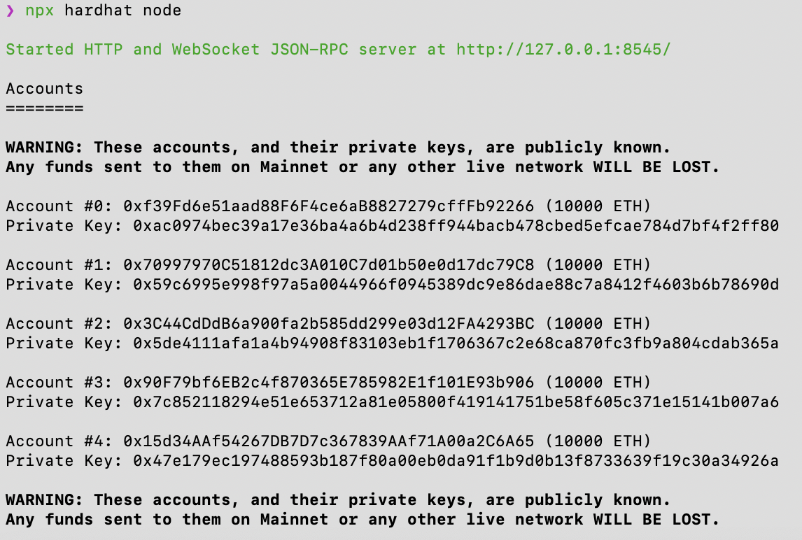

2. **Creating a `.env` File (If it doesn't already exist)**:  
   Create an `.env` file in the root directory to configure environment variables:  
   ```bash
   touch .env
   ```

3. **Environment Variables Setup**:  
   Ensure that your `.env` file includes the required configurations for deploying contracts, including private keys and RPC URLs. You can add these manually, or they may be generated after running `npm run local`.  
   Example of the `.env` file contents after `npm run local` command:  
   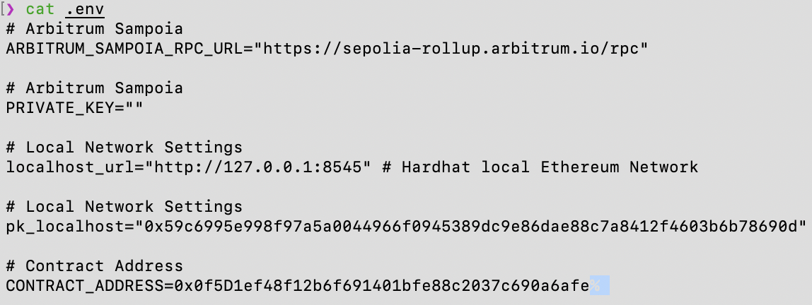

4. **Deploying the Contract (Skip if already completed in a previous step)**:  
   Deploy the contract to the local Hardhat network:  
   ```bash
   npm run local
   ```
   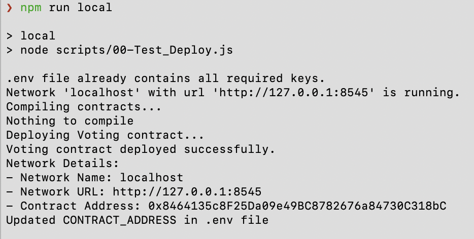

5. **Adding Candidates**:  
   Add one or more candidates to the voting process using the script:  
   ```bash
   CANDIDATES=Alice,Bob,Charlie,Dave npm run local:add       # Local Network
   ```
   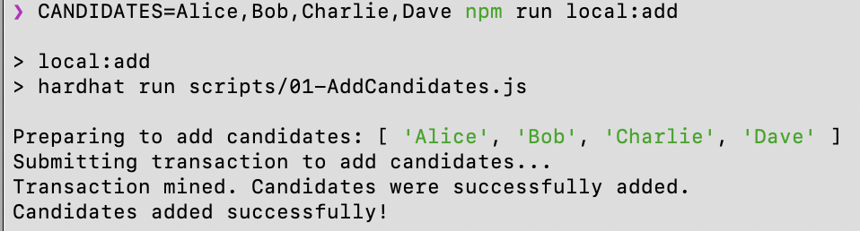

6. **Retrieving Candidate Indices**:  
   Retrieve all candidate indices to confirm they have been successfully added to the voting process and to identify their indices for voting or removal purposes:  
   ```bash
   npm run local:indices    # Local Network
   ```
   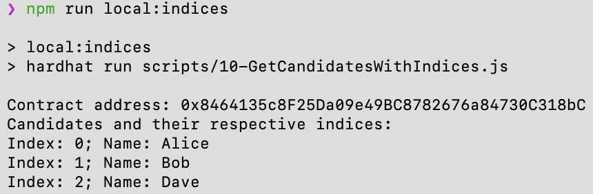

7. **Removing a Candidate**:  
   Remove a candidate by his index from the voting process before voting starts using 'CANDIDATE_INDEX' in the following command:  
   ```bash
   CANDIDATE_INDEX=2 npm run local:remove       # Local Network
   ```
   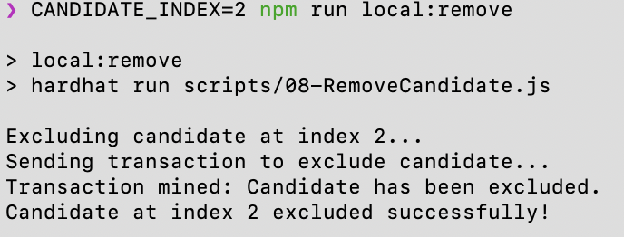

8. **Starting the Voting Process**:  
   Start the voting session. The duration of the voting process can be set in the `.env` file using the `VOTING_DURATION` variable (default: 600 seconds):  
   ```bash
   npm run local:start
   ```
   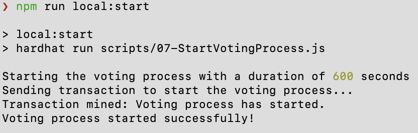

9. **Casting Votes (First Vote)**:  
   Cast your vote for a candidate. Specify the `CANDIDATE_INDEX` in the voting command when running this command:  
   ```bash
   npm run local:vote       # Local Network
   ```
   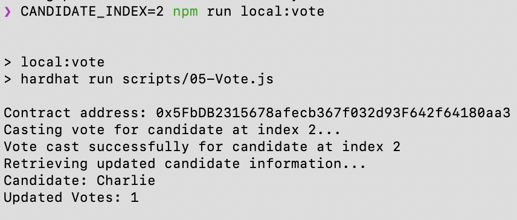

10. **Checking Remaining Time After First Vote**:  
    Check the remaining time for the voting process after casting the first vote:  
    ```bash
    npm run local:time       # Local Network
    ```
    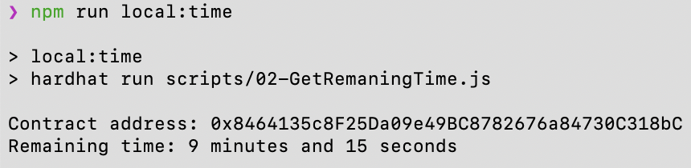

11. **Retrieving Voting Results**:  
    Display the current vote counts for all candidates:  
    ```bash
    npm run local:votes      # Local Network
    ```
    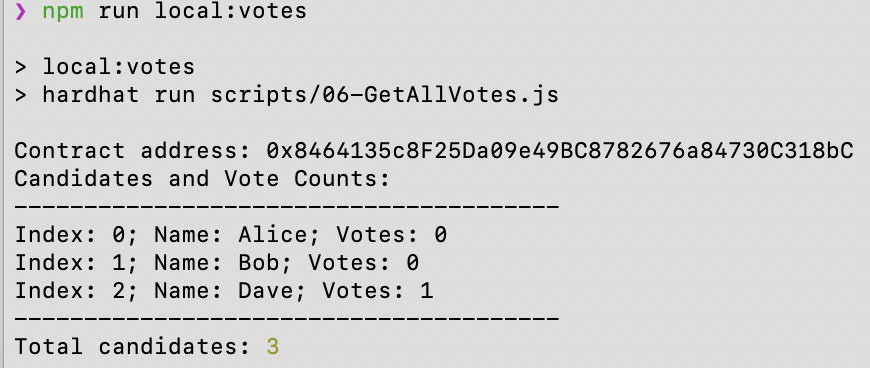

12. **Casting Votes (Second Vote)**:  
    Cast another vote using a different private key:  
    ```bash
    npm run local:vote       # Local Network
    ```
    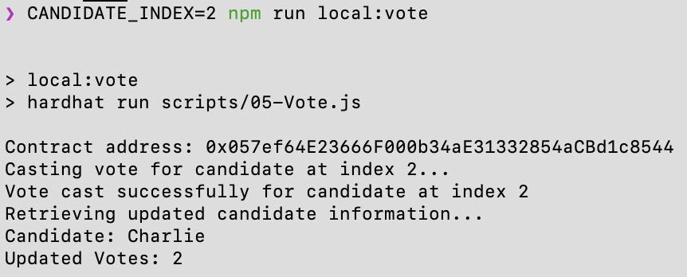

13. **Checking Remaining Time After Second Vote**:  
    Verify the remaining time for the voting process after casting the second vote:  
    ```bash
    npm run local:time       # Local Network
    ```
    

14. **Checking Voting Status**:  
    Check the current status of the voting process (e.g., NotStarted, Ongoing, Ended):  
    ```bash
    npm run local:status     # Local Network
    ```
    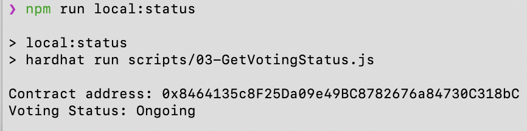

15. **Ending the Voting Process**:  
    End the voting process and lock in the results:  
    ```bash
    npm run local:end        # Local Network
    ```
    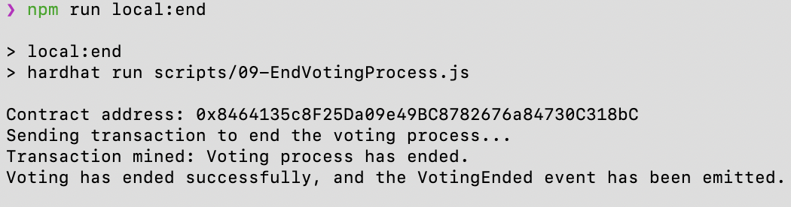


## Running Tests

This project includes automated tests that run on a non-persistent network. To execute all tests, use:

```bash
npm run test
```

> **Note:** The tests run using the hardhat network, which is temporary and resets with each test run. Running npx hardhat test without specifying the Hardhat network will not work as expected because it requires a non-persistent network. By default, the Hardhat network is set to be persistent to simulate a working environment similar to the Arbitrum network. Please use 'npx hardhat test --network hardhat' or 'npm run test' to ensure the tests run correctly on the intended non-persistent network.

## Troubleshooting

This section provides solutions for common issues you might encounter while deploying or interacting with the Voting DApp.

### **1. CONTRACT_ADDRESS Not Set**

**Problem**: The `CONTRACT_ADDRESS` in the `.env` file is empty or missing after deployment.

**Solution**:
- Ensure that the contract deployment was successful. Check the terminal for the contract address after running the deployment script.
- If the address is displayed in the terminal but not updated in `.env`, manually copy and paste the address into the `CONTRACT_ADDRESS` variable.
- Double-check that the `.env` file is correctly formatted and saved without additional spaces or invalid characters.

---

### **2. Insufficient Funds**

**Problem**: Deployment or transactions fail due to lack of ETH in the wallet for gas fees.

**Solution**:
- For local testing:
  - Use the Hardhat node’s pre-funded accounts. These accounts already have a large amount of ETH for testing purposes.
- For Arbitrum Sepolia:
  - Obtain testnet ETH from a trusted faucet. For example:
    - [L2 Faucet](https://www.l2faucet.com/arbitrum/)
    - [Arbitrum Sepolia Faucet List](https://arbitrum.faucet.dev/ArbSepolia)
  - Check your MetaMask wallet balance to confirm receipt of ETH. If the funds do not arrive, try using another faucet or verify the network configuration in MetaMask.

---

### **3. Local Network Issues**

**Problem**: Scripts fail to run on the local network or the deployment process times out.

**Solution**:
- Verify that the Hardhat local node is running:
  - Open a terminal and start the node with `npx hardhat node`.
- Ensure the `pk_localhost` variable in the `.env` file is correctly set with a valid private key. You can use the default Hardhat testing private key:  
  `"0xac0974bec39a17e36ba4a6b4d238ff944bacb478cbed5efcae784d7bf4f2ff80"`.
- Confirm that the local network URL is correctly configured:
  - `localhost_url="http://127.0.0.1:8545"`

---

### **4. MetaMask Configuration Issues**

**Problem**: MetaMask is not connecting to the correct network, or transactions fail to process.

**Solution**:
- Check that MetaMask is configured for the correct network:
  - For local testing, ensure MetaMask is connected to the localhost network at `http://127.0.0.1:8545`.
  - For Arbitrum Sepolia, verify that the network is added and active with the correct RPC URL:  
    `https://sepolia-rollup.arbitrum.io/rpc`.
- Ensure your wallet has sufficient funds to cover gas fees.

---

### **5. Deployment Script Errors**

**Problem**: Deployment scripts fail to execute or terminate with errors.

**Solution**:
- Confirm that all dependencies are installed by running `npm install`.
- Check the Hardhat configuration (`hardhat.config.js`) for any syntax errors or missing configurations.
- If deploying to Arbitrum Sepolia, verify that the `ARBITRUM_SAMPOIA_RPC_URL` and `PRIVATE_KEY` variables are set in the `.env` file.

---

### **6. Voting Period Not Ending**

**Problem**: The voting period remains active even after the specified time duration.

**Solution**:
- Remember that the voting period duration is updated only when a state change occurs (e.g., casting a vote). If the voting period appears to be stuck, trigger a state change by interacting with the contract (e.g., add a vote or finalize the process).
- Double-check the `VOTING_DURATION` in the `.env` file to ensure it is set correctly.

---

### **7. Hardhat Node Resets**

**Problem**: The local network state resets when restarting the Hardhat node, causing deployed contracts and data to disappear.

**Solution**:
- Avoid restarting the Hardhat node during testing. If a restart is necessary, re-deploy the contracts and reset the `.env` variables accordingly.
- Use Hardhat's `scripts` to automate re-deployment and setup after a node restart.

---

### **8. Test Failures**

**Problem**: Automated tests fail or do not produce the expected results.

**Solution**:
- Verify that the Hardhat network is set to a non-persistent mode for testing:
  - Run tests using `npm run test` or `npx hardhat test --network hardhat`.
- Check for syntax errors or incorrect assumptions in the test scripts.
- If you made changes to the contract, ensure the tests are updated to match the new functionality.

---

### **9. Faucet Issues**

**Problem**: Faucets do not provide testnet ETH, or funds are delayed.

**Solution**:
- Try alternative faucets if the one you are using is unavailable or out of funds.
- Check the [Arbitrum Network Status](https://status.arbitrum.io/) for any ongoing issues with the Sepolia network.
- If possible, request testnet ETH from a colleague or team member who has access to the testnet.

## Conclusion

The Voting DApp demonstrates the power and flexibility of blockchain technology in creating transparent and secure voting systems. Designed for deployment on the Arbitrum network while maintaining compatibility with local testing environments, this application highlights how smart contracts can streamline voting processes with enhanced trust and accountability.

This project also serves as a valuable educational tool, showcasing Solidity smart contract development, integration with Hardhat, and the use of decentralized networks. By following the step-by-step instructions and utilizing the provided scripts, users can easily deploy, test, and interact with the Voting DApp.

Whether used as a foundation for further development or as a practical learning exercise, the Voting DApp illustrates the potential of decentralized applications to solve real-world challenges. Contributions, feedback, and improvements are always welcome to enhance the project's utility and reach.

Thank you for exploring the Voting DApp, and we hope it serves as an inspiring step toward building innovative blockchain solutions.
